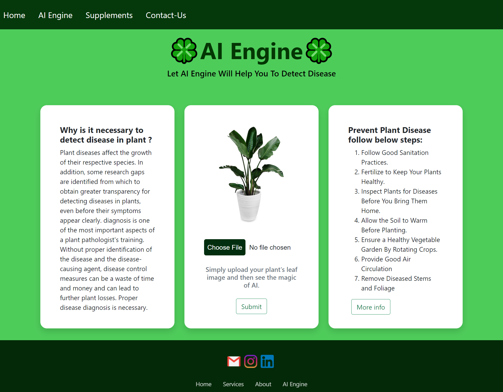

# ⭐Plant-Disease-Detection
* Plant disease detection and cure is a web app created using Deep learning. It uses Convolutional Neural Network for classifying Leaf images into 39 Different Categories. The Convolutional Neural Code has been built in Pytorch Framework. For Training - Plant village dataset.

## ⭐Run Project in your Machine
* You must have python install in your machine.
* Create a Python Virtual Environment & Activate Virtual Environment [Link](https://docs.python.org/3/tutorial/venv.html)
* Install all the dependencies using below command
    `pip install -r requirements.txt`
* Go to the `Flask Deployed App` folder
* Add the downloaded file in `Flask Deployed App` folder.
* Run the Flask app using below command `python3 app.py`

## ⭐Snippet of Web App :
#### Main page
  
#### AI Engine 
  
#### Results Page 
  
#### Supplements/Fertilizer  Store
  

